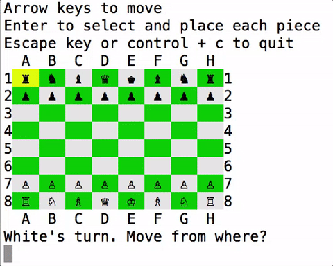

# Chess

#### Terminal Chess game built with Ruby using OOP principles.




## To play this game:

- `git clone` https://github.com/shjang1007/chess.git
- Navigate to the chess folder
- Run `bundle install` in the terminal console
- Run `ruby lib/game.rb` in the terminal console to start the game
- At the top of the chess board, you will find further directions!

## Technical Features

- Chess game is implemented with OOP principles in mind
- Use of inheritances and modules to keep code DRY
- Class inheritances and modules keep codes modular
- Keep internal implementation methods as private methods

### Modules
One module to handle Rook, Queen, and Bishop's moves
```ruby
module SlidingPiece
  HORIZONTAL = [[0, 1], [0, -1]]
  VERTICAL = [[1, 0], [-1, 0]]
  DIAGONALS = [[1, 1], [-1, -1], [-1, 1], [1, -1]]

  def moves
    moves = []
    move_dirs.each do |possible_move|
      new_pos = pos
      while true
        new_pos = grow_unblocked_moves_in_dir(new_pos, possible_move)
        # Stops when the pos is out of grid
        # Stops when the pos is blocked
        break if stop?(new_pos)
        moves << new_pos

        # Stops when the pos is after the different color piece
        break if different_color_piece?(new_pos)
      end
    end

    moves
  end

  private

  def different_color_piece?(pos)
    ...
  end

  def stop?(pos)
    ...
  end

  def grow_unblocked_moves_in_dir(new_pos, possible_move)
    ...
  end
end
```


### Class Inheritances
All chess pieces including null pieces (empty space) inherits from Piece Class
```ruby
class Piece

  ...

  attr_reader :board, :color
  attr_accessor :pos

  def initialize(board, pos, color = nil)
    @board, @pos, @color = board, pos, color
  end

  ...

end
```

Bishop will inherit from Piece and use SlidingPiece module
This OOP allows for modular and DRY codes as shown below
```ruby
class Bishop < Piece
  include SlidingPiece

  def move_dirs
    DIAGONALS
  end
end
```

## Future Features

- Add more strategies to AI player. (Currently computer player can only make random moves)
- JavaScript to handle frontend display of the game.
